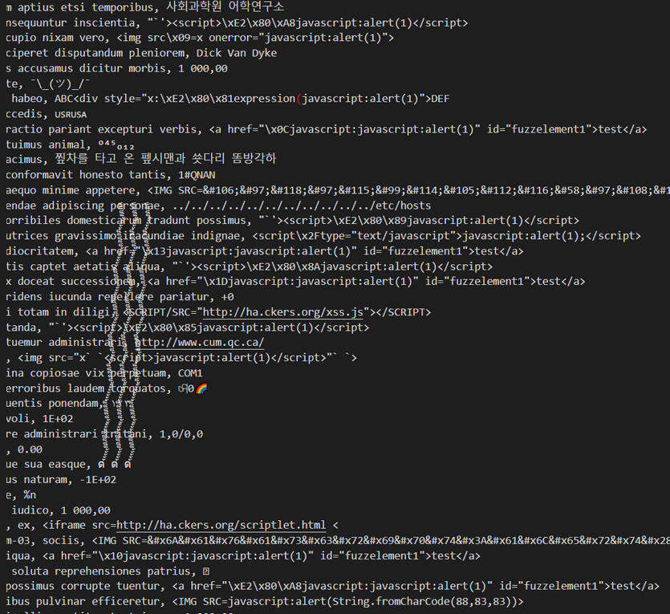
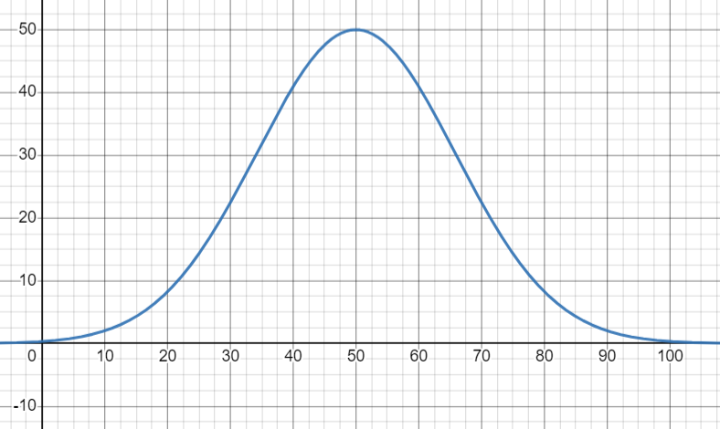
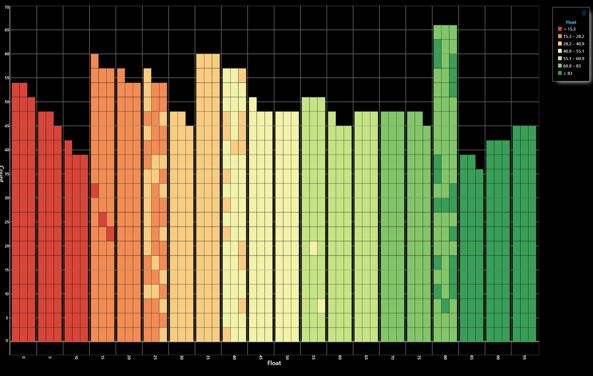
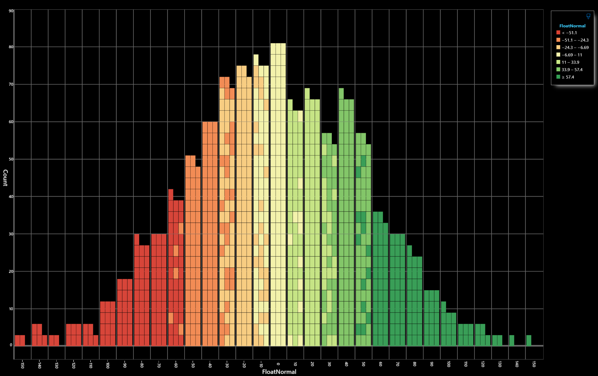
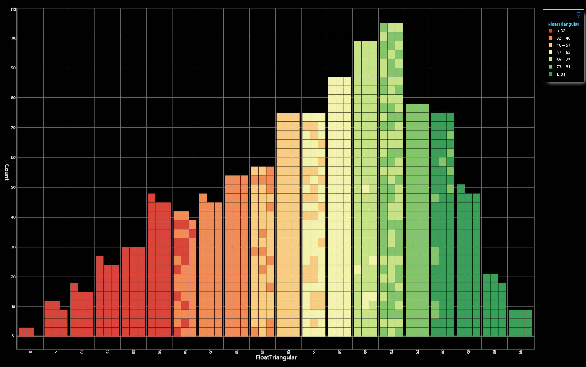
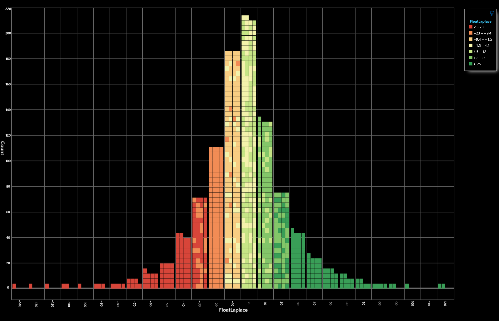
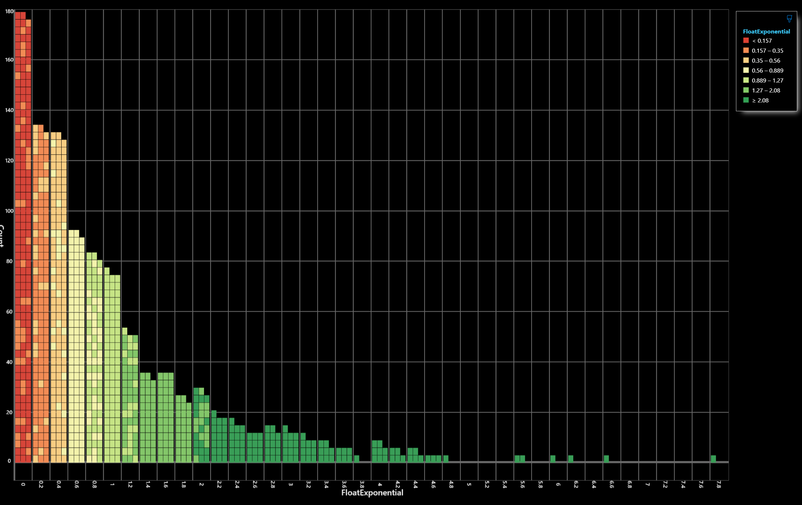
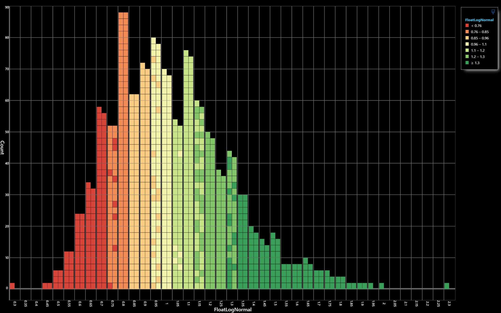
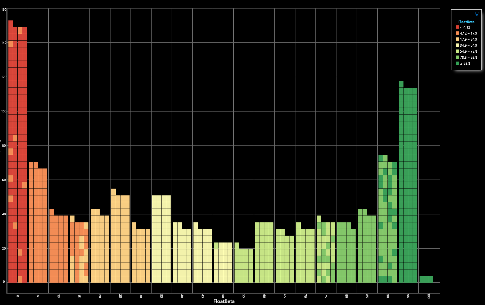

# Fake File Builder
Génération de données aléatoire dans un fichier texte


# Usage
Le programme se lance en ligne de commande. il prend en paramètre un nombre de ligne à générer, et un fichier de configuration json

```bash
FakeFileBuilder.exe /Lines="1000" /Configuration="C:\path\to\configuration-file.json"
```

Le format des fichiers de configuration est le suivant
```json
{
	"OutputFile": "C:\\path\\to\\file-to-create.ext",
	"Culture": "[Culture code]",
	"FirstLine": "[First line to write to output file]",
	"Patterns": [
		{
			"Template": "...",
			"Weight": [integer]
		},
		...
	],
	"Tokens": [
		{
			"Name": "tokenName",
			"Type": "[tokenType]",
			"Parameters": {
				...
			}
		},
		...
	],
	"PickUpLists": {
		"[listName]": [
			{
				"Weight": [integer],
				"Value": "[value]"
			},
			...
		],
		...
	}
}
```
`OutputFile` est le nom du fichier qui sera créé et contiendra le résultat de la génération de données.

`Culture` contient le code de la culture à utiliser pour le formatage des valeurs. les codes disponibles sont disponible sur la page [Microsoft/Supported Culture Codes](https://learn.microsoft.com/en-us/bingmaps/rest-services/common-parameters-and-types/supported-culture-codes)

`FirstLine` contient la première ligne de texte à écrire au debut du fichier généré, comme une entete csv par exemple.

# Patterns
Les patterns sont les modèles de rendus de lignes. ils sont utilisés de manière aléatoire en fonction de leur poids (Weight). 

Par exemple,les patterns suivants seront présent dans le fichier de sortie comme suit : "A" pour 2/3, "B" pour 1/3 et "C" absent car un poids égal à zéro :

```json
"Patterns": [
	{ "Template": "A - Lorem Ipsum", "Weight": 2 },
	{ "Template": "B - Lorem Ipsum", "Weight": 1 },
	{ "Template": "C - Lorem Ipsum", "Weight": 0 },
]
```
Les poids sont utilisés dans un calcul global de repartition. par exemples des poids "100, 50, 50" auront le même effet que "2, 1, 1".  
dans l'exemple ci-dessus, le tempalte "A" apparaitra deux fois plus que le template "B".

Chaque Pattern produira une ligne de texte à partir d'un modèle défini dans "Template". ce modèle est une chaine de caractère contenant des "token" qui seront remplacés par l'évaluation qui en sera faite pour chaque ligne. 

Ce template s'appuie sur une syntaxe [DotLiquid](https://github.com/dotliquid/dotliquid). Les tokens sont placés entre double-accolades : `{{Token}}`, alors que les blocs de contrôles DotLiquid sont entre accolade-pourcent : ``.

# Tokens

## Tokens pré-definis
Certains tokens peuvent être directement utilisés dans avoir besoin de les définir dans la section `Tokens` du fichiers de configuration.

### CurrentLine
`{{CurrentLine}}` sera remplacé par le numéro de ligne du fichier en cours de génération.

### CurrentDate
`{{CurrentDate}}` sera remplacé par la date courante au moment de la génération de la ligne.

### Non encore implémenté
- `{{CurrentTemplate}}` : le code du template utilisé
- `{{CurrentOutputFile}}` : le nom du fichier de sortie actuel
- `{{CurrentProgression}}` : le pourcentage courant de progression de génération `100 * (numéro de ligne / nombre total de ligne)`

## PickupList
La section `PickupList` peut contenir des listes de valeurs simple à utiliser dans les les templates sans devoir les adjoindre dans un fichier texte ou csv par ailleurs. Ces listes présentent un ensemble de valeurs assortie d'un poids qui determinera leurs probabilités d'apparition.

Dans l'exemple ci-dessous, nous définissons une liste nommée `MyList` contenant 4 éléments `E-01`, `E-02`, `E-03`, `E-04` qui ont une probabilité d'apparition décroissante telle que `E-01` dispose de 4 fois plus de chance d'apparaitre que `E-04` par exemple.

```json
"MyList": [
	{ "Weight": 1, "Value": "E-04" },
	{ "Weight": 2, "Value": "E-03" },
	{ "Weight": 3, "Value": "E-02" },
	{ "Weight": 4, "Value": "E-01" }
]
```

La definition du token piochant dans cette liste est alors la suivante : 

```json
{
	"Name": "tkFromList",
	"Type": "PickUpList",
	"Parameters": {
		"ListName": "MyList"
	}
}
```

Ce token `tkFromList` peux ensuite être utilisé dans un template de la section `Patterns` : 
```json
"Patterns": [
	{ "Template": "Lorem ipsum {{tkFromList}} doloris amet" },
]
```

## Types de token

La definition d'un token de génération se présente sous la forme suivante : 
```json
{
	"Name": "NomDuToken",
	"Type": "...",
	"Parameters": {
		...,
		"Format": "..."
	}
}

```
La valeur `Name` correspond au nom du token qui sera utilisée dans les templates définis précédament. 
Le `Type` défini la nature de la donnée produite, et `Parameters` contient les paramètres propres au type choisi.
Un paramètre commun `Format` contient une chaine de caractères indiquant la représentation textuelle finale du token dans le template. Si aucune valeur n'est saisie, le formatage par défaut `"{0}"` sera utilisé. La chaine de formatage doit correspondre au type renvoyé, et respecter les specifications suivantes : [Overview: How to format numbers, dates, enums, and other types in .NET](https://learn.microsoft.com/en-us/dotnet/standard/base-types/formatting-types)


### Integer
Génère un **nombre entier** compris entre les paramètres `Min` et `Max`, et affiche sa valeur selon le `Format` spécifié.

Le `Format` est une chaine de caractère respectant la syntaxe suivante : [Standard numeric format strings](https://learn.microsoft.com/en-us/dotnet/standard/base-types/standard-numeric-format-strings) et [Custom numeric format strings](https://learn.microsoft.com/en-us/dotnet/standard/base-types/custom-numeric-format-strings)

```json
{
	"Name": "MyInteger",
	"Type": "Integer",
	"Parameters": {
		"Min": "10",
		"Max": "50",
		"Format": "{0:N0}"
	}
}
```

Sur ce type scalaire, il est possible d'appliquer une loi de distribution continue telles que définies ci-dessous : uniforme, normale, triangulaire, Laplace, exponentielle, LogNormale, Beta, Cauchy.

Exemple suivant : une [distribution normale](https://en.wikipedia.org/wiki/Normal_distribution) centrée autours de la valeur moyenne `mean=0` et d'un ecart type `stddev=50`.

```json
{
	"Name": "MyInteger",
	"Type": "Integer",
	"Parameters": {
		"Distribution": "Normal",
		"mean": "0",
		"stddev": "50",
		"Format": "{0:N0}"
	}
}
```


### Decimal
Génère un **nombre décimal** compris entre les paramètres `Min` et `Max`, et affiche sa valeur selon le `Format` spécifié.

Le `Format` est une chaine de caractère respectant la syntaxe suivante : [Standard numeric format strings](https://learn.microsoft.com/en-us/dotnet/standard/base-types/standard-numeric-format-strings) et [Custom numeric format strings](https://learn.microsoft.com/en-us/dotnet/standard/base-types/custom-numeric-format-strings)

```json
{
	"Name": "MyDecimal",
	"Type": "Decimal",
	"Parameters": {
		"Min": "0",
		"Max": "300",
		"Format": "{0:0.00}"
	}
}
```

Sur ce type scalaire, il est possible d'appliquer une loi de distribution continue telles que définies ci-dessous : uniforme, normale, triangulaire, Laplace, exponentielle, LogNormale, Beta, Cauchy.

Exemple suivant : une [distribution normale](https://en.wikipedia.org/wiki/Normal_distribution) centrée autours de la valeur moyenne `mean=0` et d'un ecart type `stddev=50`.

```json
{
	"Name": "MyDecimal",
	"Type": "Decimal",
	"Parameters": {
		"Distribution": "Normal",
		"mean": "0",
		"stddev": "50",
		"Format": "{0:N0}"
	}
}
```


### DateTime
Génère une **date** comprise entre les paramètres `Min` et `Max`, et affiche sa valeur selon le `Format` spécifié.

Le `Format` est une chaine de caractère respectant la syntaxe suivante : [Standard date and time format strings](https://learn.microsoft.com/en-us/dotnet/standard/base-types/standard-date-and-time-format-strings) et [Custom date and time format strings](https://learn.microsoft.com/en-us/dotnet/standard/base-types/custom-date-and-time-format-strings)

```json
{
	"Name": "MyDate",
	"Type": "DateTime",
	"Parameters": {
		"Min": "2023-01-01 14:00:00",
		"Max": "2023-01-02 23:30:00",
		"Format": "le {0:dddd dd MMMM yyyy} à {0:HH:mm:ss}"
	}
}
```

Sur ce type scalaire, il est possible d'appliquer une loi de distribution continue telles que définies ci-dessous : uniforme, normale, triangulaire, Laplace, exponentielle, LogNormale, Beta, Cauchy.

Exemple suivant : une [distribution normale](https://en.wikipedia.org/wiki/Normal_distribution) centrée autours de la valeur moyenne 01/06/2023 `mean=2023-06-01` et d'un ecart type de 10 jours `stddev=10:0:0:0`.

```json
{
	"Name": "MyDate",
	"Type": "DateTime",
	"Parameters": {
		"Distribution": "Normal",
		"mean": "2023-06-01",
		"stddev": "10:0:0:0",
		"Format": "{0:yyyy-MM-dd}"
	}
}
```


### Duration
Génère une **durée** comprise entre les paramètres `Min` et `Max`, et affiche sa valeur selon le `Format` spécifié.

Le `Format` est une chaine de caractère respectant la syntaxe suivante : [Standard TimeSpan format strings](https://learn.microsoft.com/en-us/dotnet/standard/base-types/standard-timespan-format-strings) et [Custom TimeSpan format strings](https://learn.microsoft.com/en-us/dotnet/standard/base-types/custom-timespan-format-strings)

```json
{
	"Name": "MyDuration",
	"Type": "Duration",
	"Parameters": {
		"Min": "0:0:30",
		"Max": "1:30:00",
		"Format": "{0:hh}:{0:mm}:{0:ss}"
	}
}
```

Sur ce type scalaire, il est possible d'appliquer une loi de distribution continue telles que définies ci-dessous : uniforme, normale, triangulaire, Laplace, exponentielle, LogNormale, Beta, Cauchy.

Exemple suivant : une [distribution normale](https://en.wikipedia.org/wiki/Normal_distribution) centrée autours de la valeur moyenne 1H `mean=0:1:0:0` et d'un ecart type 2 minutes `stddev=0:0:2:0`.

```json
{
	"Name": "MyDuration",
	"Type": "Duration",
	"Parameters": {
		"Distribution": "Normal",
		"mean": "0:1:0:0",
		"stddev": "0:0:2:0",
		"Format": "{0:hh}:{0:mm}"
	}
}
```


### Boolean
Génère un **booléen** équiprobable `True` ou `False`, et affiche sa valeur selon le `Format` spécifié.

Le `Format` est une chaine de caractère respectant la syntaxe suivante : [Standard TimeSpan format strings](https://learn.microsoft.com/en-us/dotnet/standard/base-types/standard-timespan-format-strings) et [Custom TimeSpan format strings](https://learn.microsoft.com/en-us/dotnet/standard/base-types/custom-timespan-format-strings)

Il est possible d'adapter le rendu avec l'utilisation des fonctions DotLiquid disponibles dans le template, comme par exemple : `OuiNon`

```json
{
	"Name": "MyBoolean",
	"Type": "Boolean",
	"Parameters": {
		"Format": "valid={0}"
	}
}
```

Notez que le `True` a autant de chance d'apparaitre que `False`. Une function `RandomPercentBool` de template permet par exemple de produire un booléen 80/20 sans recourt à un token : `YESNO`

*note : Non encore implémenté : paramètre "Probability" qui prendra une valeur entre 0 et 100% pour la proportion de répartition des valeurs 'true', et a terme une distribution continue sur l'intervalle [0;1] également.*

### Guid
Génère un **GUID** [Global Unique IDentifier](https://fr.wikipedia.org/wiki/Globally_unique_identifier) , et affiche sa valeur selon le `Format` spécifié.

Le `Format` est une chaine de caractère respectant la syntaxe suivante propre au Guid : [Microsoft / Guid.ToString](https://learn.microsoft.com/en-us/dotnet/api/system.guid.tostring?view=net-8.0#system-guid-tostring(system-string))

```json
{
	"Name": "MyGuid",
	"Type": "Guid",
	"Parameters": {
		"Format": "valid={0}"
	}
}
```
### RegEx
Génère une **chaine de caractère** qui correspondra à une [expression régulière](https://fr.wikipedia.org/wiki/Expression_r%C3%A9guli%C3%A8re) , et affiche sa valeur selon le `Format` spécifié.

De nombreux outils permèttent de tester des expressions régulières en ligne, comme par exemple [regex101.com](https://regex101.com/), [regexr.com](https://regexr.com/)

Voici par exemple un générateur de numéro de plaque d'immatriculation française récente.

```json
{
	"Name": "MyRegEx",
	"Type": "RegEx",
	"Parameters": {
		"Pattern": "^[A-HJ-NP-TV-Z]{2}-[0-9]{3}-[A-HJ-NP-TV-Z]{2}$"
	}
}
```

### IncrementalDateTime
Génère une **date** qui débute à la valeur `Start`, incrémentée à chaque ligne d'un nombre de milliseconde compris entre `MinIncrement` et `MaxIncrement`, et affiche sa valeur selon le `Format` spécifié.

Le `Format` est une chaine de caractère respectant la syntaxe suivante : [Standard date and time format strings](https://learn.microsoft.com/en-us/dotnet/standard/base-types/standard-date-and-time-format-strings) et [Custom date and time format strings](https://learn.microsoft.com/en-us/dotnet/standard/base-types/custom-date-and-time-format-strings)


Voici un exemple de date aléatoire qui débute au 01/01/2023 à 00H00, et qui à chaque ligne sera incrémenté d'un nombre de millisecondes compris entre 5 et 250.

```json
{
	"Name": "timestampRandom",
	"Type": "IncrementalDateTime",
	"Parameters": {
		"Format": "{0:yyyy-MM-dd HH:mm:ss.fff}",
		"Start": "2023-01-01 00:00:00",
		"MinIncrement": "5",
		"MaxIncrement": "250"
	}
}
```

### IncrementalInteger
Génère un **nombre entier** qui débute à la valeur `Start`, incrémenté à chaque ligne d'un nombre compris entre `MinIncrement` et `MaxIncrement`, et affiche sa valeur selon le `Format` spécifié.

Le `Format` est une chaine de caractère respectant la syntaxe suivante : [Standard numeric format strings](https://learn.microsoft.com/en-us/dotnet/standard/base-types/standard-numeric-format-strings) et [Custom numeric format strings](https://learn.microsoft.com/en-us/dotnet/standard/base-types/custom-numeric-format-strings)


Voici un exemple de nombre aléatoire qui débute à 100, et qui à chaque ligne sera incrémenté d'un nombre compris entre 1 et 10.
```json
{
	"Name": "compteurRandom",
	"Type": "IncrementalInteger",
	"Parameters": {
		"Format": "{0}",
		"Start": "100",
		"MinIncrement": "1",
		"MaxIncrement": "10"
	}
}
```

### Email
Génère une **chaine de caractères** qui correspond à une adresse email aléatoire.

Le token ne prend aucun paramètre, et les emails générés sont de qualité médiocre. Dans le cadre d'un usage à des fin de validation CRM par exemple, il conviendrait d'utiliser des fonctions de compositions entre les nom, prénom et fournisseurs d'accès pour construire des emails probables et cohérents. Ceci est montré dans l'exemple "users.json".

```json
{
	"Name": "Email",
	"Type": "Email"
}
```

### IPV4
Génère une **chaine de caractères** qui correspond à une [adresse IP](https://fr.wikipedia.org/wiki/Adresse_IP) v4 aléatoire qui correspond au reseau `Network` indiqué. Les IPs de réseaux et broadcast sont ignorées. seules les IPs utilisables sont générées.

de nombreux calculateurs en lignes d'IP par range existent et peuvent aider à constuire le reseau à utiliser : [ipcalculator.com](https://ipcalculator.com/), [networkcalculator.ca/ip-calculator.php](http://networkcalculator.ca/ip-calculator.php)


Par exemple, ce token produira des valeurs d'IP d'un réseau locale de 192.168.1.1 à 192.168.1.254. 
```json
{
	"Name": "MyIP",
	"Type": "IPV4",
	"Parameters": {
		"Network": "192.168.1.0/24",
		"Format": "{0}"
	}
}
```

### IPV6
Génère une **chaine de caractères** qui correspond à une [adresse IP](https://fr.wikipedia.org/wiki/Adresse_IP) v6 aléatoire qui correspond au reseau `Network` indiqué. Les IPs de réseaux et broadcast sont ignorées. seules les IPs utilisables sont générées.

de nombreux calculateurs en lignes d'IP par range existent et peuvent aider à constuire le reseau à utiliser : [ipcalculator.com](https://ipcalculator.com/)

Par exemple, ce token produira des valeurs d'IP v6 de 2001:0db8:0000:0000:0000:0000:0000:0000 à 2001:0db8:0000:0000:ffff:ffff:ffff:ffff. 
```json
{
	"Name": "MyIP",
	"Type": "IPV6",
	"Parameters": {
		"Network": "2001:0db8::/64"
	}
}
```

### MACAddress
Génère une **chaine de caractères** qui correspond à une [adresse MAC](https://fr.wikipedia.org/wiki/Adresse_MAC) aléatoire.

Les adresses générées sont fortement aléatoires. Dans le cas d'un usage d'analyse de process proche du réél, il conviendrait mieux d'utiliser un generateur regex configuré ou même combiner un generateur regex en fin de chaine à la suite d'une selection de préfix dans une liste des addresse MAC par vendeurs : [maclookup.app](https://maclookup.app/)

```json
{
	"Name": "addr",
	"Type": "MACAddress"
}
```

### LoremIpsum
Génère une **chaine de caractères** qui correspond au fameux [Lorem Ipsum](https://fr.wikipedia.org/wiki/Lorem_ipsum) et dont le nombre de mots sera compris entre `Min` et `Max`.

exemple : génération d'un faux texte contenant entre 1 et 5 mots.
```json
{
	"Name": "fauxTexte",
	"Type": "LoremIpsum",
	"Parameters": {
		"Min": "1",
		"Max": "5"
	}
}
```

### Coordinates
Génère un **object complexe** qui correspond à un point GPS placé à une distance comprise `DistanceMin` et `DistanceMax` en kilometres du point dont les coordonées sont données par `OriginLatitude` et `OriginLongitude`.

ce token GPS peut être utilisé dans le template de pattern comme suit :
```json
"Template"="Lat={{GPS.Latitude}} Long={{GPS.Longitude}} DD={{GPS.DD}} DMS={{GPS.DMS}}"
```

- `.Latitude` : latitude du point en décimal
- `.Longitude` : longitude du point en décimal
- `.DD` : adresse complète en degrés décimal (ex : 46.30795° N, 4.88299° E)
- `.DMS` : adresse complète en degrés minutes secondes (ex : 46° 18' 28.61" N, 4° 52' 58.75" E)

exemple : 
```json
{
	"Name": "GPS",
	"Type": "Coordinates",
	"Parameters": {
		"OriginLatitude": "46.3077473",
		"OriginLongitude": "4.8812409",
		"DistanceMax": "1",
		"DistanceMin": "0.5"
	}
}
```

### NaughtyString
Génère un **chaine de caractère** très certainement détéctée comme malveillante par les IPS/IDS.

Attention, ce token peut injecter des caractères non imprimables qui peut alterer le système et le rendu textuel des logs comme le montre la capture d'écran ci-dessous



Le token prend en paramètre la valeur `Categories` qui permet de choisir les type de chaines à produire, mais il n'est pas encore fonctionnel.

exemple : 
```json
{
	"Name": "nsTest",
	"Type": "NaughtyString",
	"Parameters": {
		"Categories": "NumericStrings"
	}
}
```
### PickUpList
pioche un **élément de liste** parmis ceux déclaré dans la section `PickUpLists`. la séléction de l'élément au sein de cette liste se fait conformément au poids de chaque élément.

exemple : 
```json
{
	"Name": "PickUpList",
	"Type": "PickUpList",
	"Parameters": {
		"ListName": "DemoList"
	}
}
```

### ExternalTextFile
Pioche un **une ligne d'un fichier texte** de manière uniforme dans le fichier passé en paramètre `TextFileName`.

Si le paramètre `DistributionExpression` est renseigné, le poids de chaque ligne qui corresponds à sa probabilité d'apparaitre est une fonction mathématiques qui utilise `position` comme une valeur allant de 0 à 100% comme la position de la ligne dans le fichier.

la ligne n°1250 sur un fichier de 5000 lignes corresponds à la position 1250/5000*100 = 25


exemple : sélection d'une ligne dans un fichier texte avec une probabilité continue pseudo-normale donné par la fonction `50*e^(-0.002*(position-50)^2)` qui ressemble à une distribution normale centrée sur le milieu du fichier



Le debut et la fin du fichier seront alors très peu représentés dans les lignes tirées au hasard.

```json
{
	"Name": "TxtList",
	"Type": "ExternalTextFile",
	"Parameters": {
		"TextFileName": "C:\\path\\to\\text-file.txt",
		"DistributionExpression": "50*e^(-0.002*(position-50)^2)"
	}
}
```

### ExternalCsv
Pioche un une ligne d'un fichier csv et renvoie un **object complexe** de manière uniforme dans le fichier passé en paramètre `CsvFileName`.

L'extraction des propriétés de l'objet s'effectue en respectant les noms de colones données en entête du fichier CSV. le séparateur des valeurs est défini par le paramètre `CsvDelimiter`.

Si le paramètre `DistributionExpression` est renseigné, le poids de chaque ligne qui corresponds à sa probabilité d'apparaitre est une fonction mathématiques qui utilise `position` comme une valeur allant de 0 à 100% comme la position de la ligne dans le fichier.

La ligne n°1250 sur un fichier de 5000 lignes corresponds à la position 1250/5000*100 = 25

`DistributionExpression` peut aussi utiliser des valeurs d'une colone comme le poids de la ligne par rapport aux autres.


Dans un fichier nommé `Prenoms.csv`, contruit comme suit : 
```csv
valeur;genre;frequence
abel;m;0.1
absolon;m;0.01
achille;m;0.08
christelle;f;3.1
christian;m;4.81
christine;f;6.75
...
```
l'utilisation d'un token `Prenom` dans un template de pattern serait par exemple :
```json
"Template" : "Lorem Ipsum M.Mme {{prenom.valeur}} doloris amet ..."
```

exemple : sélection uniforme dans le fichier

```json
{
	"Name": "CsvUniform",
	"Type": "ExternalCsv",
	"Parameters": {
		"CsvFileName": "C:\\path\\to\\Prenoms.csv",
		"CsvDelimiter": ";"
	}
}
```

exemple : sélection d'une ligne dans un fichier  avec une probabilité continue pseudo-normale donné par la fonction `50*e^(-0.002*(position-50)^2)` qui ressemble à une distribution normale centrée sur le milieu du fichier


Le début et la fin du fichier seront alors très peu représentés dans les lignes tirées au hasard.

```json
{
	"Name": "CsvByExpression",
	"Type": "ExternalCsv",
	"Parameters": {
		"CsvFileName": "C:\\path\\to\\Prenoms.csv",
		"CsvDelimiter": ";",
		"DistributionExpression": "50*e^(-0.002*(position-50)^2)"
	}
}
```

exemple : sélection d'une ligne dans un fichier avec une probabilité qui s'appuie sur la fréquence de la ligne applatie un peu l'utilisation d'un log.

les valeurs à extraire pour le calcul de l'expression de distribution `DistributionExpression` sont renseignées dans le paramètre `CsvDistributionValueExtractions`

```json
{
	"Name": "CsvByColumnExpression",
	"Type": "ExternalCsv",
	"Parameters": {
		"CsvFileName": "C:\\path\\to\\Prenoms.csv",
		"CsvDelimiter": ";",
		"CsvDistributionValueExtractions": "frequence",
		"DistributionExpression": "log(frequence+1)"
	}
}
```

## les répartitions
Par default, le tirage dans les listes (pickup, csv et fichier texte) se fait de manière uniforme. Un poids de repartition peut être définit

### PickUpList : utilisation de la valeur Weight
Les listes présentes dans la section `PickUpList` peuvent définir un poids sur chaque élément de la liste. plus ce poids est élevé, plus l'élément a des chance d'être utilisé dans la liste.

par exemple, une liste de domaines de fournisseur d'adresses emails avec sur chacun, un poids proportionel à leur popularité produira une repartission de valeurs aléatoires comme suit : 


```json
"PickUpLists": {
		"domaines": [
			{ "Weight": 3, "Value": "free.fr" },
			{ "Weight": 5, "Value": "gmail.com" },
			{ "Weight": 2, "Value": "hotmail.com" },
			{ "Weight": 2, "Value": "yopmail.com" },
			{ "Weight": 1, "Value": "yahoo.fr" },
			{ "Weight": 1, "Value": "sfr.fr" }
		]
	}
```

### DistributionExpression : expression de distribution
Sur les listes de valeurs extraites à paritr de fichier texte ou de fichiers CSV, il est possible d'appliquer une distribution calculée à partir de deux paramètres simples : 
- **position** : la position dans la liste en pourcentage entre 0% et 100%
- **row** : le numéro de la ligne dans le fichier

La fonction de distribution prend alors la forme d'une formule mathématiques donnant le poids de chaque ligne en fonction des paramètres qui lui sont passés.

exemple : une répartition en distribution normale centrée autours de 50%
```json
"DistributionExpression": "e^(-0.002*(position-50)^2)"
```
sur les listes extraites de fichiers CSV, il est aussi possible d'extraire des valeurs numériques dans les colones et les passer en paramètres de l'expression de distribution.

## les fonctions
La valeur des tokens produits sont encore manipulables au moment de l'écriture dans le template grace à la syntaxe <a href="https://github.com/dotliquid/dotliquid">DotLiquid</a>.

Quelques fonction prédefinies permettent de manipuler les résultats.

- **Modulo** : reste de la division euclidienne
- **DividedBy** : quotien de la division euclidienne
- **Times** : multiplication
- **Morse** : conversion en morse transforme `SOS` en `... --- ...`
- **NatoPhonetics** : conversion en phonetics de l'OTAN (Alpha Bravo Charlie)
- **Capitalize** : Premières lettre de chaque mot en majuscule
- **Downcase** : tout en minuscule
- **Upcase** : tout en majuscule
- **Size** : nombre de caractère de la chaine
- **Escape** : échape les caractères HTML : transforme `"Batman & Robin"` en `&quot;Batman &amp; Robin&quot;`
- **StripHtml** : supprime le markup HTML : transforme `<p><span class="test">word01</span> word02</p>` en `word01 word02`
- **RandomValue** : retourne une valeur au hasard parmis la liste précédente. transforme par exemple `{{ 'value 01,value 02,value 03'|RandomValue }}` en `value 02`
- **if** : bloc conditionnel `valeur si truevaleur sinon`

quelques exemples 

```json
"Template": "{{CurrentLine}},LowHigh, {{CurrentLine | Modulo:4}}, {{CurrentLine | DividedBy:4}}, {{CurrentLine | Times:10}},{{SmallLorem }}, {{SmallLorem | Morse}}, {{SmallLorem | NatoPhonetics}}, {{Lorem}}, {{Lorem | Capitalize}}, {{Lorem | Downcase}}, {{Lorem | Upcase}}, {{Lorem | Size}}, {{ ToEscape | Escape }}, {{ToStrip}}, {{ToStrip | StripHtml}}, {{ 'value 01,value 02,value 03'|RandomValue }}"
```
```
1,Low, 1, 0, 10,09sI, ----- ----. ... .., zero-nine-sierra-india, inmensae ostendis tincidunt patrius, Inmensae Ostendis Tincidunt Patrius, inmensae ostendis tincidunt patrius, INMENSAE OSTENDIS TINCIDUNT PATRIUS, 35, &quot;Tom &amp; Robin&quot;, <p>onzt <span>dbmy</span> ifi <strong>txeii</strong></p>, onzt dbmy ifi txeii

2,Low, 2, 0, 20,s4sB, ... ....- ... -..., sierra-four-sierra-bravo, iudicabit putet liquidae, Iudicabit Putet Liquidae, iudicabit putet liquidae, IUDICABIT PUTET LIQUIDAE, 24, &quot;Batman &amp; Jerry&quot;, <p>ldb <span>qdqwd</span> rxne <strong>rgso</strong></p>, ldb qdqwd rxne rgso

3,Low, 3, 0, 30,LU01, .-.. ..- ----- .----, lima-uniform-zero-one, principes renovata, Principes Renovata, principes renovata, PRINCIPES RENOVATA, 18, &quot;Tom &amp; Jerry&quot;, <p>xjc <span>ndn</span> kkmu <strong>lgnf</strong></p>, xjc ndn kkmu lgnf

4,Low, 0, 1, 40,04sN, ----- ....- ... -., zero-four-sierra-november, captiosa gustare emolumenti clamat, Captiosa Gustare Emolumenti Clamat, captiosa gustare emolumenti clamat, CAPTIOSA GUSTARE EMOLUMENTI CLAMAT, 34, &quot;Tom &amp; Jerry&quot;, <p>rwy <span>goizc</span> vclts <strong>dsy</strong></p>, rwy goizc vclts dsy

```

## Distributions continues sur les tokens scalaires
Afin de générer des données proche d'un comportement attendu de la vie rééle, il est possible de generer les valeurs de tokens scalaires (`Integer`, `Decimal`, `DateTime`, `Duration`) selon une function de distribution continue.


### distribution uniforme
[La distribution uniforme](https://en.wikipedia.org/wiki/Continuous_uniform_distribution) permet de générer une valeur dans une plage définie en fonction de la fonction de distribution illustrée ci-dessous.

Si aucun Distribution n'est specifiée, c'est une distribution uniforme qui est appliquée.



### distribution normale
[La distribution normale](https://en.wikipedia.org/wiki/Normal_distribution) permet de générer une valeur dans une plage définie en fonction de la fonction de distribution illustrée ci-dessous.

Distribution normale sur un token Integer :
```json
{
	"Name": "IntNormal",
	"Type": "Integer",
	"Parameters": {
		"Distribution": "Normal",
		"mean": "0",
		"stddev": "50",
		"Format": "{0}"
	}
}
```

Distribution normale sur un token Decimal :
```json
{
	"Name": "FloatNormal",
	"Type": "Decimal",
	"Parameters": {
		"Distribution": "Normal",
		"mean": "0",
		"stddev": "50",
		"Format": "{0:0.00}"
	}
}
```

Distribution normale sur un token DateTime :
```json
{
	"Name": "DateTimeNormal",
	"Type": "DateTime",
	"Parameters": {
		"Distribution": "Normal",
		"mean": "2023-06-01",
		"stddev": "10:0:0:0",
		"Format": "{0:yyyy-MM-dd}"
	}
}
```

Distribution normale sur un token Duration :
```json
		{
			"Name": "DurationNormal",
			"Type": "Duration",
			"Parameters": {
				"Distribution": "Normal",
				"mean": "0:1:0:0",
				"stddev": "0:0:2:0",
				"Format": "{0:hh}:{0:mm}"
			}
		}
```




### distribution triangulaire
[La distribution triangulaire](https://en.wikipedia.org/wiki/Triangular_distribution) permet de générer une valeur dans une plage définie en fonction de la fonction de distribution illustrée ci-dessous.

Distribution triangulaire sur un token Integer :
```json
{
	"Name": "IntTriangular",
	"Type": "Integer",
	"Parameters": {
		"Distribution": "Triangular",
		"Min": "0",
		"Max": "100",
		"Mode": "75",
		"Format": "{0}"
	}
}
```

Distribution triangulaire sur un token Decimal :
```json
{
	"Name": "FloatTriangular",
	"Type": "Decimal",
	"Parameters": {
		"Distribution": "Triangular",
		"Min": "0",
		"Max": "100",
		"Mode": "75",
		"Format": "{0:0.00}"
	}
}
```

Distribution triangulaire sur un token DateTime :
```json
{
	"Name": "DateTimeTriangular",
	"Type": "DateTime",
	"Parameters": {
		"Distribution": "Triangular",
		"Min": "2023-01-01",
		"Max": "2024-01-01",
		"Mode": "2024-08-01",
		"Format": "{0:yyyy-MM-dd}"
	}
}
```

Distribution triangulaire sur un token Duration :
```json
{
	"Name": "DurationTriangular",
	"Type": "Duration",
	"Parameters": {
		"Distribution": "Triangular",
		"Min": "00:00:01",
		"Max": "1:00:00",
		"Mode": "00:45:00",
		"Format": "{0:hh}:{0:mm}"
	}
}
```




### distribution de Laplace
[La distribution de Laplace](https://en.wikipedia.org/wiki/Laplace_distribution) permet de générer une valeur dans une plage définie en fonction de la fonction de distribution illustrée ci-dessous.

Distribution de Laplace sur un token Integer :
```json
{
	"Name": "IntLaplace",
	"Type": "Integer",
	"Parameters": {
		"Distribution": "Laplace",
		"location": "0",
		"scale": "20",
		"Format": "{0}"
	}
}

```
Distribution de Laplace sur un token Decimal :
```json
{
	"Name": "FloatLaplace",
	"Type": "Decimal",
	"Parameters": {
		"Distribution": "Laplace",
		"location": "0",
		"scale": "20",
		"Format": "{0:0.00}"
	}
}
```

Distribution de Laplace sur un token DateTime :
```json
{
	"Name": "DateTimeLaplace",
	"Type": "DateTime",
	"Parameters": {
		"Distribution": "Laplace",
		"location": "2023-06-01",
		"scale": "10:0:0:0",
		"Format": "{0:yyyy-MM-dd}"
	}
}
```

Distribution de Laplace sur un token Duration :
```json
{
	"Name": "DurationLaplace",
	"Type": "Duration",
	"Parameters": {
		"Distribution": "Laplace",
		"location": "00:10:00",
		"scale": "0:0:10",
		"Format": "{0:hh}:{0:mm}"
	}
}
```




### distribution exponentielle
[La distribution exponentielle](https://en.wikipedia.org/wiki/Exponential_distribution) permet de générer une valeur dans une plage définie en fonction de la fonction de distribution illustrée ci-dessous.

Distribution exponentielle sur un token Integer :
```json
{
	"Name": "IntExponential",
	"Type": "Integer",
	"Parameters": {
		"Distribution": "Exponential",
		"lambda": "1",
		"Min": "0",
		"Max": "100",
		"Format": "{0}"
	}
}
```

Distribution exponentielle sur un token Decimal :
```json
{
	"Name": "FloatExponential",
	"Type": "Decimal",
	"Parameters": {
		"Distribution": "Exponential",
		"lambda": "1",
		"Min": "0",
		"Max": "100",
		"Format": "{0:0.00}"
	}
}
```

Distribution exponentielle sur un token DateTime :
```json
{
	"Name": "DateTimeExponential",
	"Type": "DateTime",
	"Parameters": {
		"Distribution": "Exponential",
		"lambda": "0.0001",
		"Min": "2023-01-01",
		"Max": "2024-01-01",
		"Format": "{0:yyyy-MM-dd HH:mm:ss}"
	}
}
```

Distribution exponentielle sur un token Duration :
```json
{
	"Name": "DurationExponential",
	"Type": "Duration",
	"Parameters": {
		"Distribution": "Exponential",
		"lambda": "0.0001",
		"Min": "00:00:01",
		"Max": "1:00:00",
		"Format": "{0:hh}:{0:mm}"
	}
}
```




### distribution LogNormale
[La distribution LogNormale](https://en.wikipedia.org/wiki/Log-normal_distribution) permet de générer une valeur dans une plage définie en fonction de la fonction de distribution illustrée ci-dessous.

Distribution LogNormale sur un token Integer :
```json
{
	"Name": "IntLogNormal",
	"Type": "Integer",
	"Parameters": {
		"Distribution": "LogNormal",
		"mu": "0",
		"sigma": "0.25",
		"Format": "{0}"
	}
}
```

Distribution LogNormale sur un token Decimal :
```json
{
	"Name": "FloatLogNormal",
	"Type": "Decimal",
	"Parameters": {
		"Distribution": "LogNormal",
		"mu": "0",
		"sigma": "0.25",
		"Format": "{0:0.00}"
	}
}
```

Distribution LogNormale sur un token DateTime :
```json
{
	"Name": "DateTimeLogNormal",
	"Type": "DateTime",
	"Parameters": {
		"Distribution": "LogNormal",
		"Min": "2023-01-01",
		"Max": "2024-01-01",
		"Format": "{0:yyyy-MM-dd}"
	}
}
```

Distribution LogNormale sur un token Duration :
```json
{
	"Name": "DurationLogNormal",
	"Type": "Duration",
	"Parameters": {
		"Distribution": "LogNormal",
		"Min": "00:00:01",
		"Max": "1:00:00",
		"Format": "{0:hh}:{0:mm}"
	}
}
```




### distribution Beta
[La distribution Beta](https://en.wikipedia.org/wiki/Beta_distribution) permet de générer une valeur dans une plage définie en fonction de la fonction de distribution illustrée ci-dessous.

Distribution Beta sur un token Integer :
```json
{
	"Name": "IntBeta",
	"Type": "Integer",
	"Parameters": {
		"Distribution": "Beta",
		"alpha": "0.5",
		"beta": "0.5",
		"Min": "0",
		"Max": "100",
		"Format": "{0}"
	}
}
```

Distribution Beta sur un token Decimal :
```json
{
	"Name": "FloatBeta",
	"Type": "Decimal",
	"Parameters": {
		"Distribution": "Beta",
		"alpha": "0.5",
		"beta": "0.5",
		"Min": "0",
		"Max": "100",
		"Format": "{0:0.00}"
	}
}
```

Distribution Beta sur un token DateTime :
```json
{
	"Name": "DateTimeBeta",
	"Type": "DateTime",
	"Parameters": {
		"Distribution": "Beta",
		"alpha": "0.5",
		"beta": "0.5",
		"Min": "2023-01-01",
		"Max": "2024-01-01",
		"Format": "{0:yyyy-MM-dd}"
	}
}
```

Distribution Beta sur un token Duration :
```json
{
	"Name": "DurationBeta",
	"Type": "Duration",
	"Parameters": {
		"Distribution": "Beta",
		"alpha": "0.5",
		"beta": "0.5",
		"Min": "00:00:01",
		"Max": "1:00:00",
		"Format": "{0:hh}:{0:mm}"
	}
}
```


